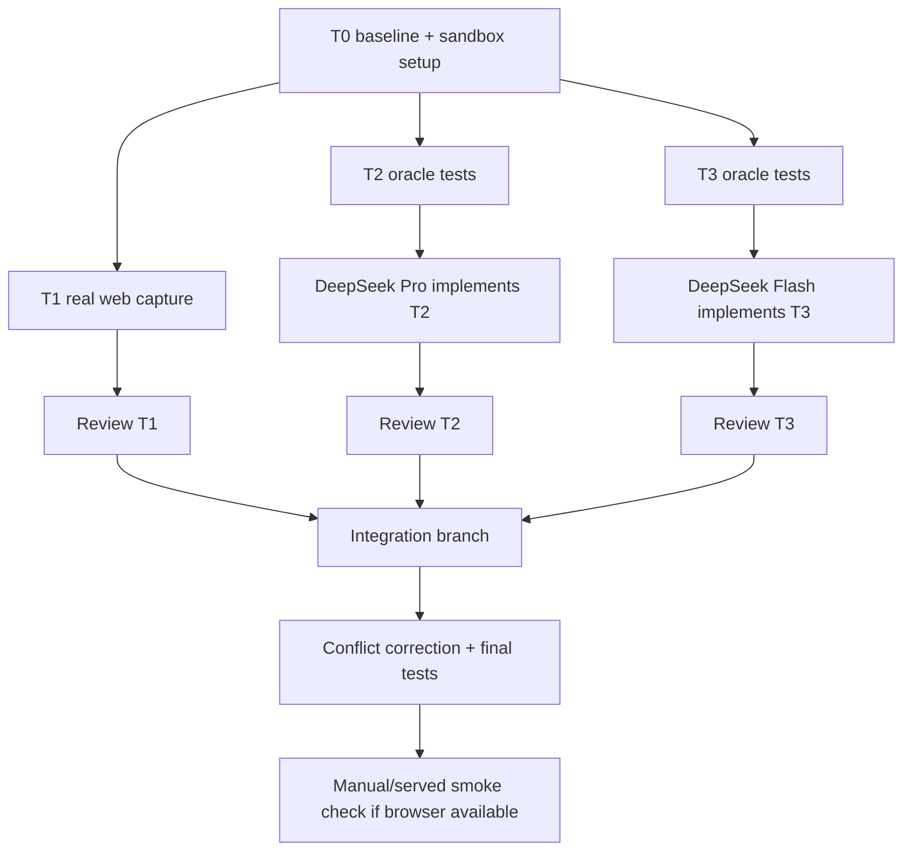

# Frontend parallel pipeline plan

> Date: 2026-06-29  
Role split: GPT-5.5/Zed acts as orchestrator, reviewer, integrator, and corrector.
> Goal: make the new-tab frontend real, not just a shell: capture writes files, reading/recognition surfaces load real data, and resurface actions persist.

## Startable summary

⏱ Size: one heavy sitting, split into 3 bounded implementation lanes plus review/integration.  
▶ First action: create the sandbox layout and baseline tests before any delegated executor runs.  
✓ Done when: focused frontend/service tests pass, no executor touched files outside its sandbox, and the integrated branch has real web capture + live reading/recognition + persistent resurface actions.

## Constraints and guardrails

- Source of truth stays in plain files; SQLite remains derived.
- Static shell stays open; data/action routes stay token-gated.
- Capture path remains sacred: zero filing/tagging decisions, instant confirmation only after a real write or an honest offline/failure state.
- No new Node/build stack.
- No raw backlog counts, red badges, overdue copy, or shame framing.
- Any machine action that changes user-visible state must be reversible or transparently recoverable.
- DeepSeek/OpenModel executor sandboxes must not write outside this project tree.

## Sandbox / branch layout

Because the `aider-delegate` wrapper is known to reject linked git worktrees that have a `.git` file, DeepSeek executor runs will use local nested clones under the project directory, excluded from the main repo. We still use separate branches for every lane, and an integration worktree for reviewed changes.

Planned local-only ignored paths:

```text
PKMS/.worktrees/        # linked worktrees for GPT-5.5/integration lanes
PKMS/.delegates/        # full local clones for aider-delegate executor lanes
```

Add these to `.git/info/exclude`, not `.gitignore`, unless we intentionally decide the convention should be tracked.

Branches:

| Lane | Location | Branch | Owner | Purpose |
|---|---|---|---|---|
| Integration | `PKMS/.worktrees/frontend-pipeline` | `orchestrate/frontend-pipeline` | GPT-5.5 | Merge reviewed lane diffs and run final validation |
| T1 | `PKMS/.worktrees/t1-web-capture` | `feat/web-capture-real` | GPT-5.5 / optional GPT-5.4 subagent | Make web capture actually POST to `/capture` |
| T2 | `PKMS/.delegates/t2-reading` | `delegate/t2-reading-surfaces` | DeepSeek direct `deepseek-v4-pro` | Backend/read surfaces for reading queue + recognition cards |
| T3 | `PKMS/.delegates/t3-resurface` | `delegate/t3-resurface-actions` | OpenModel.ai `deepseek-v4-flash` | Persist resurface not-now / let-go actions |

Executor sandboxes:

- Delegates receive only task-specific editable files.
- Orchestrator writes failing oracle tests first and gives them to delegates as read-only context.
- Delegates must not edit tests unless explicitly assigned; oracle hash is recorded before each run.
- After each run, trust `git diff --stat`/`git status`, not aider's applied-edit count.
- Any delegate output that changes tests, creates stray files, edits outside scope, or misses the oracle is discarded.

## Pipeline overview



## T0 — baseline, sandboxes, and oracle-first setup

⏱ Size: 20–30 min  
▶ First action: record current focused test baseline and create local-only sandbox dirs.  
✓ Done when: integration branch/worktree exists, delegate clones exist, oracle tests are committed before executor edits.

Steps:

1. Confirm clean main working tree.
2. Add `.worktrees/` and `.delegates/` to `.git/info/exclude`.
3. Create integration worktree/branch from `main`.
4. Create T1 worktree/branch from `main`.
5. Create T2/T3 nested clones under `.delegates/`, each on its own branch.
6. Run baseline:
   ```sh
   .venv/Scripts/python.exe -m pytest tests/test_web_assets.py tests/test_web_ext.py tests/test_capture_service.py -q
   ```
7. Write/commit failing oracle tests on the relevant lane bases before delegation.

## T1 — real web capture

Owner: GPT-5.5 directly; optional GPT-5.4 subagent only if we want a second review of the JS interaction.

⏱ Size: 45–75 min  
▶ First action: edit `src/pkms/web/app.js::saveCapture()` so it POSTs to `/capture` with the current token query.  
✓ Done when: Ctrl/Cmd+Enter in the web capture box creates a markdown file in `vault/inbox/` through the existing server endpoint.

Expected files:

- `src/pkms/web/app.js`
- `tests/test_web_assets.py` or `tests/test_capture_service.py` for source/route regression checks

Implementation shape:

- `saveCapture()` becomes async.
- Preserve the text until the POST returns `200`.
- POST raw text to `/capture` with `location.search` and `source=web` if needed.
- On success: show saved confirmation, clear/reset box, call `loadToday()` to refresh inbox count.
- On failure: leave text in the box and show a gentle error (`not saved yet — service unreachable`), no fake success.

Review checklist:

- No fake filename generation presented as proof.
- No capture-time filing/tagging/priority fields.
- Empty capture remains no-op.
- Token failure is disclosed without losing text.

## T2 — live reading queue + recognition cards

Owner: DeepSeek direct `deepseek-v4-pro`, reviewed/corrected by GPT-5.5.

⏱ Size: 1.5–2.5h including review  
▶ First action: write oracle tests for read-only endpoints before delegation.  
✓ Done when: reading route and “worth a glance” rail render real queued reading/resurface data from token-gated APIs.

Proposed backend/API scope:

- `GET /api/recognition-cards` → `today.recognition_cards(vault, index_dir)`
- `GET /api/reading-queue` → queued `vault/resources/reading/*.md`, oldest promoted first, includes `title`, `minutes`, `promoted`, `why`, `path`
- Possibly `GET /api/recent-notes` deferred unless needed for a non-empty search route; do not let T2 balloon.

Expected editable files for delegate:

- `src/pkms/today.py`
- `src/pkms/capture_service.py`
- optionally `src/pkms/web/app.js` if the executor can keep the edit small

Read-only oracle/context files:

- focused tests written by GPT-5.5 before the run
- `src/pkms/web/app.js` if backend-only delegation is chosen
- `spike/newtab-firefox/DATA-CONTRACT.md`

Preferred split to reduce merge conflicts:

- DeepSeek Pro implements backend helpers/endpoints.
- GPT-5.5 integrates frontend fetch/render glue in `app.js` if needed.

Review checklist:

- Endpoints are token-gated.
- Reading state comes from note frontmatter, not `.index` only.
- Recognition cards are side-effect-free; they must not record resurface offers.
- No raw pile/backlog copy in UI.
- JSON paths are vault-relative forward-slash paths.

Fallbacks:

- If DeepSeek output truncates or only partially applies, keep useful small edits only after diff review; otherwise discard and implement manually.
- If T2 and T3 conflict in `capture_service.py`, GPT-5.5 resolves manually on integration branch.

## T3 — persistent resurface actions

Owner: OpenModel.ai `deepseek-v4-flash`, reviewed/corrected by GPT-5.5.

⏱ Size: 1–1.5h including review  
▶ First action: write small oracle tests for a token-gated resurface action endpoint.  
✓ Done when: web `not now` starts the no-renag/rest window and `let it go` writes the forever-exit state to frontmatter.

Important Flash scope limit:

OpenModel Flash can truncate on multi-edit tasks. Keep this lane small: ideally one backend endpoint plus tiny JS fetch hook. If the planned diff exceeds ~3–4 search/replace blocks, delegate backend-only and let GPT-5.5 handle frontend glue.

Proposed API:

```http
POST /api/resurface?token=...
Content-Type: application/json

{"path":"resources/research/foo.md","action":"not-now"}
```

Actions:

- `not-now`: call existing resurface dismiss/rest behavior; no frontmatter change unless current backend requires it.
- `let-go`: call existing `resurface.let_go`; user-visible state lives in note frontmatter.

Expected editable files for delegate:

- `src/pkms/capture_service.py`
- maybe `src/pkms/web/app.js` only if bounded

Read-only oracle/context files:

- focused tests written by GPT-5.5 before the run
- `src/pkms/resurface.py`
- relevant CLI code in `src/pkms/cli.py`

Review checklist:

- Endpoint is token-gated.
- Invalid path/action returns a non-2xx without changing files.
- `let-go` modifies frontmatter, not only the index.
- UI only hides the card after the POST succeeds; on failure it remains visible.
- Toast copy remains gentle and reversible.

Fallbacks:

- If Flash truncates or edits tests, discard and implement manually.
- If backend is good but JS is missing, GPT-5.5 integrates JS.

## Integration and correction

Owner: GPT-5.5.

⏱ Size: 45–90 min  
▶ First action: import T1, T2, and T3 reviewed diffs into `orchestrate/frontend-pipeline`.  
✓ Done when: final branch has one coherent implementation and focused tests pass.

Integration order:

1. T1 first: capture correctness is the highest-risk visible promise.
2. T2 next: read-only APIs are lower risk and easy to validate.
3. T3 last: writes user-visible state; review most carefully.

Validation gates:

```sh
.venv/Scripts/python.exe -m pytest tests/test_web_assets.py tests/test_web_ext.py tests/test_capture_service.py -q
.venv/Scripts/python.exe -m pytest tests -q
```

If browser tooling is available:

- Start temporary `pkms serve --host 127.0.0.1 --port <temp> --token review-token`.
- Open `/web/?token=review-token`.
- Verify capture textbox writes a real file.
- Verify reading/recognition routes show real data.
- Stop the temporary server before finishing.

If browser tooling is unavailable:

- Use HTTP-level tests plus source-level assertions.
- State clearly that visual render was not browser-verified.

## Out of scope for this pipeline

These are valuable but should not be mixed into the first parallel run:

- Persistent task “mark done” semantics. This touches source markdown task mutation and needs a separate careful design.
- Token hygiene/localStorage migration for PWA/new-tab URLs.
- Calm-mode nav pruning.
- Chrome-specific extension compatibility pass.

## Final deliverable

A reviewed integration branch with:

1. Real web capture.
2. Live reading queue / recognition card data.
3. Persistent resurface actions.
4. Focused and full test results recorded.
5. Delegate diffs either integrated, corrected, or explicitly rejected with reasons.

## Outcome — 2026-06-29

Integrated on `orchestrate/frontend-pipeline` and then merged to `main`.

- T1 landed directly: `src/pkms/web/app.js` now POSTs captures to `/capture`,
  preserves text on failure, and refreshes `/api/today` after a real save.
- T2 delegated to DeepSeek direct `deepseek-v4-pro`: accepted after manual
  review; added token-gated `/api/reading-queue` and `/api/recognition-cards`.
- T3 delegated to OpenModel.ai `deepseek-v4-flash`: partially accepted after
  cleanup; removed an out-of-scope `run_tests.bat`, hardened path/JSON handling,
  and wired `/api/resurface` to existing dismiss/let-go mechanics.
- Follow-up correction fixed Windows extended-path SQLite URI handling in
  `pkms promote` tests (`//?/O:/...` → `file:/O:/...`).
- Validation: full suite passed with `172 passed` on the integration branch.
